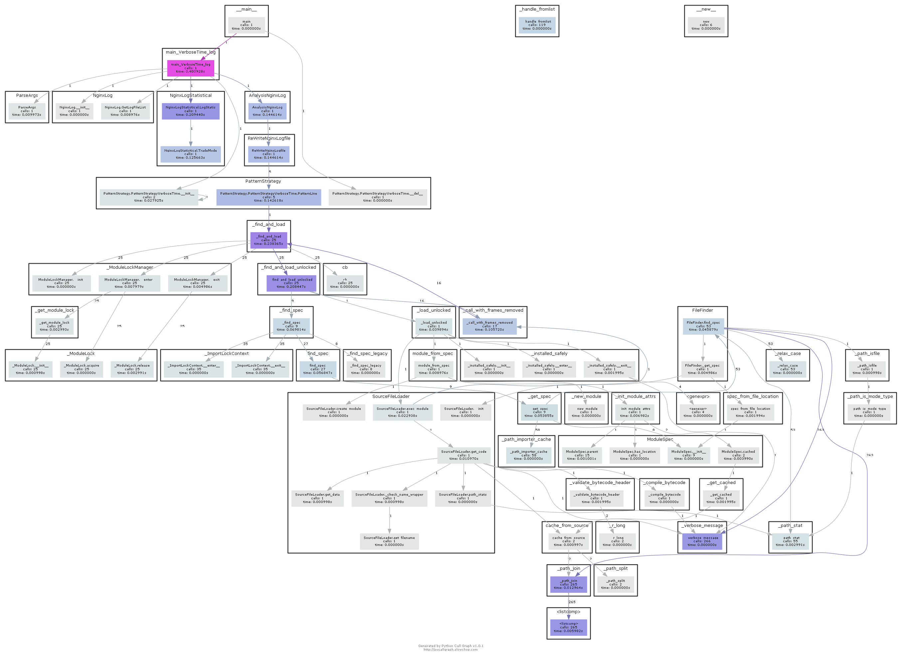

[](http://panzi.online)

# NingxLogAnslysis
nginx日志分析python小脚本

## 1 说明

> 该工程是实现nginx日志分析小功能


## 2 安装

`pip install -r requirements.txt`


## 3 使用

`python NginxLong.py -p logpath -t delta -l whitelist`

```buildoutcfg
+----+----------------------------+---------+-----------+-------------+-------+-------+-------+-------+-------+---------+-------------+----------+
|    | r_request_url_real         |   count |      mean |         std |   min |   25% |   50% |   75% |   max | 200ms   | 200-500ms   | 500ms+   |
|----+----------------------------+---------+-----------+-------------+-------+-------+-------+-------+-------+---------+-------------+----------|
|  0 | /temp/File                 |       1 | 1.891     | nan         | 1.891 | 1.891 | 1.891 | 1.891 | 1.891 | nan%    | nan%        | 100.00%  |
|  1 | /temp/api/meetInfoFill/add |       1 | 0.117     | nan         | 0.117 | 0.117 | 0.117 | 0.117 | 0.117 | 100.00% | nan%        | nan%     |
|  2 | ok  /temp/api/ok           |       3 | 0.0986667 |   0.0080829 | 0.094 | 0.094 | 0.094 | 0.101 | 0.108 | 100.00% | nan%        | nan%     |
+----+----------------------------+---------+-----------+-------------+-------+-------+-------+-------+-------+---------+-------------+----------+
```

```buildoutcfg
+----+----------------------------+------------+----------------+---------------------+---------+
|    | r_request_url_real         |   r_stutas |   status_count |   r_trade_key_str_y | rate    |
|----+----------------------------+------------+----------------+---------------------+---------|
|  0 | /temp/File                 |        200 |              1 |                   1 | 100.00% |
|  1 | /temp/api/meetInfoFill/add |        200 |              1 |                   1 | 100.00% |
|  2 | /temp/api/ok               |        200 |              2 |                   3 | 66.67%  |
|  3 | /temp/api/ok               |        403 |              1 |                   3 | 33.33%  |
+----+----------------------------+------------+----------------+---------------------+---------+
```


## 3 补充

### 1 自动生成工程依赖方法

```buildoutcfg
pip install pipreqs
linux: pipreqs ./
windows: pipreqs ./ --encoding=utf8

```

### 2 函数关系调用

> https://www.cnblogs.com/GO-NO-1/p/7155684.html

